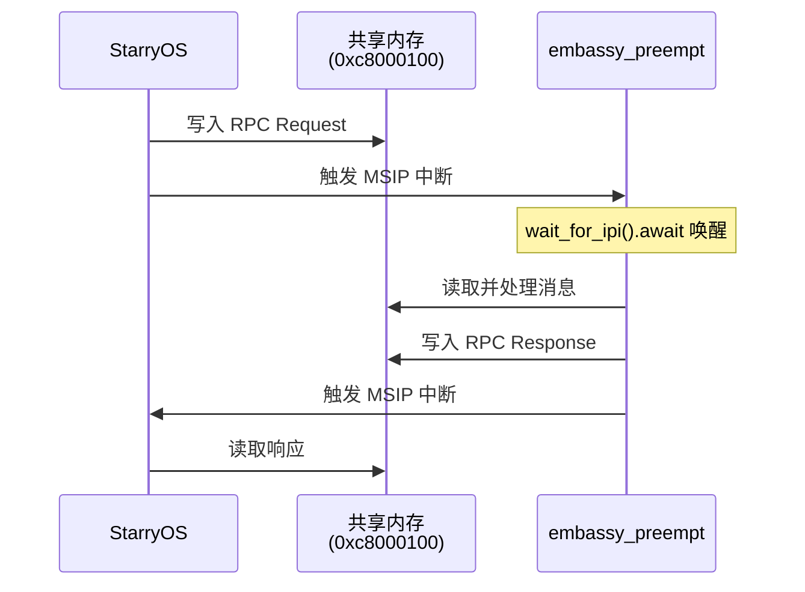

# Embassy Preempt RTOS - 2026年3月技术报告

## 一、概述

2026年3月，完成了JH7110（VisionFive 2）平台的多系统间通信机制设计与实现，成功实现了embassy_preempt与StarryOS之间的双向通信，包括Notification（通知）和RPC（远程过程调用）两种通信模式。

## 二、主要工作内容

### 2.1 延迟上下文切换机制（第十五周）

**问题描述**

在中断处理过程中直接执行 `ecall` 会导致栈状态和寄存器状态不一致。

**解决方案**

使用标志位延迟上下文切换，中断退出时检查标志位决定是否切换：

```rust
// 全局标志
pub(crate) static IN_INTERRUPT: AtomicBool = AtomicBool::new(false);
pub(crate) static NEED_CONTEXT_SWITCH: AtomicBool = AtomicBool::new(false);
```

**执行流程**：中断处理 → 检查`NEED_CONTEXT_SWITCH` → 返回1触发上下文切换 / 返回0正常mret

### 2.2 双系统间通信实现（第十七周）

#### ov-channal 通信库

[ov-channal](https://github.com/Oveln/ov_channal) - 基于环形缓冲区的无锁通信库

- **四种消息类型**：Notification、Data、RPC Request/Response
- **序列化**：使用 postcard 二进制序列化
- **内存布局**：共享内存基地址 0xc8000100，双通道（StarryOS ↔ RTOS）

#### embassy_preempt：异步IPI等待机制

- `wait_for_ipi()` 异步接口，任务可 await 等待 IPI
- IPI 等待队列管理（最多 4 个任务）
- 中断回调自动唤醒等待任务并触发上下文切换

#### embassy_preempt_app：RPC服务器

- 实现 `hello` 和 `add(x,y)` RPC 方法
- Notification 回显
- 双通道通信处理

## 三、技术架构

### RPC 通信流程



### 依赖关系

```
ov-channal (通信库)
    ↑           ↑
    │           │
StarryOS   embassy_preempt_app
    │           │
    │    embassy_preempt (wait_for_ipi)
    │           │
    └───────────┘
      双系统通信
```

## 四、技术成果

1. **延迟上下文切换**：解决中断处理过程中上下文切换的状态一致性问题
2. **ov-channal库**：无锁环形缓冲区通信库
3. **异步IPI机制**：基于Future的IPI等待接口
4. **完整双系统通信**：Notification + RPC 双向通信
