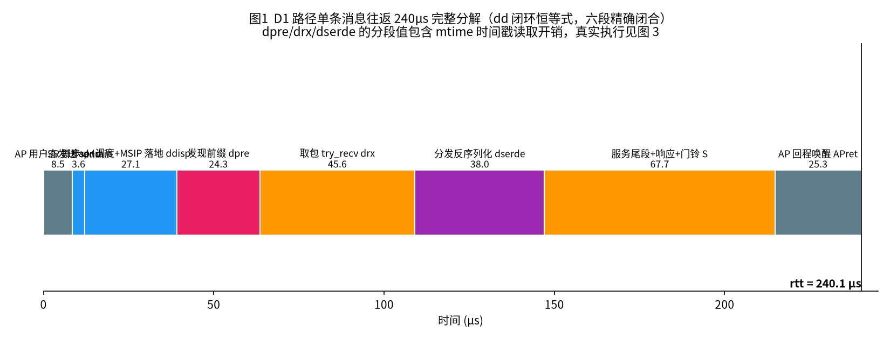
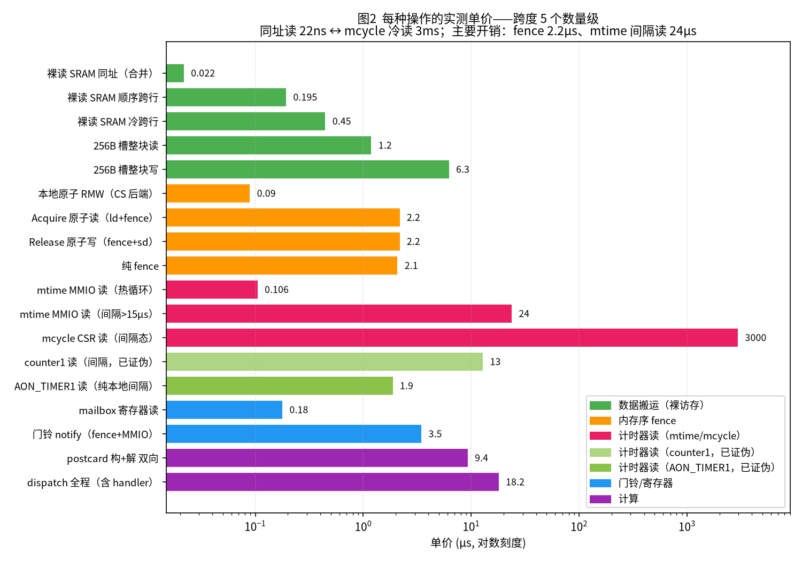
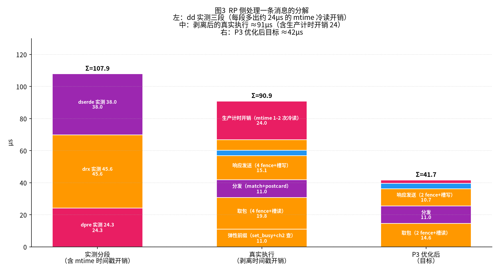
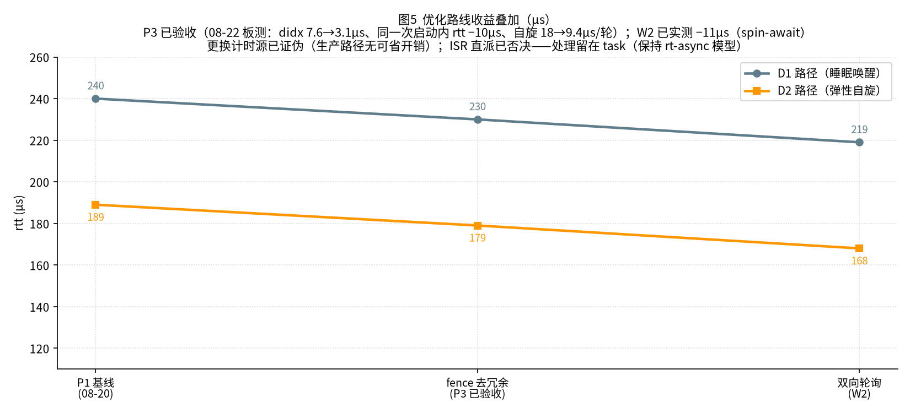

# K3 IPC 延迟归因与优化总结报告

**时间跨度**：2026-08-16 至 08-23（八天，约 20 轮真板测量）
**对象**：K3 COM260 真板，AP（X100 大核，StarryOS/Linux）与 RP（RT24 小核 @~246MHz，rt-async RTOS）之间的跨核 RPC
**结果**：单条 PING 往返 **294µs → 236.9µs（−19.5%）**；此外发现并修复了一个正确性缺陷（A4：cbo.flush 静默丢发布，见附录 B）
**本文目的**：完整说明每一微秒消耗在哪个环节、每种操作的单价是多少、各项优化成功或失败的原因。

> 全部数据为真板实测（dd 场景闭环残差 30/30 = 0.0，AP/RP 双时钟交叉校验）。
> 图表由随文脚本 `2026-08-23-K3-IPC延迟归因-make_figs.py` 生成（在本目录下运行可重新生成 5 张 PNG）。
> 本文为 2026-08-23 收官归档版（自主仓 `docs/latency-report/REPORT.md` 迁入）；测量载体
> （user-test-bench 的 dd/mb 场景、RP 侧 intercom 探针）在主仓 rt-async-amp。

---

## 0. 概要

**总体结论**：跨核 RPC 慢，主要不是协议和数据搬运的问题，而是两类不易察觉的固定开销——
**内存序 fence**（每次约 2.2µs，一条消息约需 14 次，合计约 31µs）和**计时器冷读**
（mtime 只要有间隔再读就需要 24.5µs，原因是跨时钟域同步器重新锁定）。对应措施：减少
fence 次数（P3，已完成）；更换计时器做过两次尝试，均被证伪（冷读开销在真实路径上从未
被支付，详见 §6.2）；另用一个看门狗机制恢复了优化过程中发现的缓存写回丢失问题（A4，
已完成）。

```text
以 P1 之后的 240µs 基线分解（P3 之后实测 236.9µs，构成相同）：
   AP 发送 8.5  →  门铃+唤醒链 ~40  →  RP 取包+分发 ~75  →  响应+门铃 ~20
   →  AP 收到 25  →  其中约 50µs 来自计时器读取和内存序 fence 的额外开销
```

**三项主要发现**（决定了整个优化方向）：

| # | 发现 | 实测 | 影响 |
|---|------|------|------|
| 1 | **fence 恒定 2.2µs/次**（Acquire 读实际是 `ld` + `fence r,rw`） | 四种口径均为 2198-2222ns | 每条消息热路径约 14 次 fence，合计约 31µs；这是内存序的固有开销，只能通过减少次数降低 |
| 2 | **mtime 计时器冷读 24µs/次**（间隔超过约 15µs 后跨时钟域同步器重新锁定） | 热循环 106ns，间隔 20µs 后 24.5µs（231 倍）；mcycle CSR 冷读更慢（约 2.9ms；热读仅 17ns，按核频 245.84MHz 计数） | 每条消息的计时与统计链占用 24-48µs（生产构建）或 40-70µs（测量构建）——既是真实的执行开销，也污染了所有分段测量 |
| 3 | **W2 双向轮询实测 −11µs**（AP 响应方向改为用户态自旋，免 syscall 与内核唤醒） | rtt 189→178，零固件改动 | 路线图中成本最低的下一步，预演已成功 |

**优化进展一览**（详见 §6，图 5）：

| 项 | 结果 |
|----|------|
| P1 本地原子 + timer 直连 + 别名窗 + mailbox 去 Acquire | 已完成：rtt 294→240 / D2 209→189 |
| P3 fence 去冗余 | 已验收：同一次启动内 A/B 对比 −10µs（246.9→236.9），自旋 18→9.4µs/轮 |
| 更换计时源（counter1 / AON_TIMER1 两个候选） | 已证伪并回滚：两次尝试均无效果，结论为计时源在生产路径中性 |
| P2 ISR 直派 | 已否决：不破坏 rt-async 任务模型 |
| A4 正确性修复（cbo.flush 静默丢发布） | 已完成：经四个阶段修复并验证（附录 B） |
| W2 双向轮询产品化 | 待实施：预演已实测 −11µs |

### 术语说明

| 术语 | 含义 |
|------|------|
| AP / RP | 大核 X100（运行 Linux）／小核 RT24（运行 rt-async RTOS） |
| rtt | 一条 PING 请求的完整往返时间 |
| D1 / D2 / D3 / D4 | RP 发现请求的四种路径：D1 门铃唤醒（间隔 >2s）/ D2 弹性自旋命中（<2s，无需门铃和 syscall）/ D3 批处理追加 / D4 竞态兜底 |
| W | RP 的弹性自旋窗口时长（实测约 2s）：发送间隔短于该值即走 D2，无需门铃 |
| send | AP 用户态写请求并发布缓存的耗时 |
| ddrain / ddisp | RP 中断服务里的 mailbox 排空 ／ trap 返回 + 调度 + 执行器派发 |
| dseen | RP 任务恢复到 handler 入口的总段，细分为 dpre（弹性前缀）/ drx（try_recv 取包）/ dserde（分发与反序列化） |
| didx / dslot / drest | 更细的探针分段：索引读取 ／ 消息槽读取 ／ dispatch 宏与 postcard |
| S / APret | S = 去程门铃 + RP 服务尾 + 响应门铃（与两钟相位差无关的量）；APret = AP 从收到 IRQ 到用户态读完响应 |
| fence / Acquire / Release | RISC-V 内存序指令；RP 上一条 Acquire 读约等于一次 fence，约 2.2µs |
| SPSC | 单生产者单消费者环形队列（ov-channels 通道结构：magic 头 + 读/写索引 + 128×256B 消息槽） |
| CBO / user-cbo | Zicbom 缓存维护指令（flush 为写回脏行，inval 为作废驻留副本）；user-cbo 指 AP 用户态按行自行做缓存维护，跳过内核整窗刷新 |
| mtime / mcycle / counter1 / AON_TIMER1 | 四个候选计时器：mtime（SoC 共享块，跨域）/ mcycle（CSR，核频）/ counter1（AP 域 APB）/ AON_TIMER1（RP 本地域） |
| stamps | 测量构建（probe feature）在 RPC 各阶段记录的 mtime 时间戳 |
| 闭环残差 | rtt 与各分段之和的差值，应恒为 0，用于证明整套测量自洽 |
| 探针结果不等于生产结果 | 探针（隔离微基准）测得的价格与真实路径中的价格不同——本次工作最重要的方法学结论 |
| 同一次启动内的 A/B 对比 | dd 数据只在同一次开机内可比——跨启动存在环境差异漂移（见 §6.2） |

---

## 1. 系统与一条消息的处理流程

```
┌─────────┐   写请求槽+索引       ┌──────────────┐    读槽+分发+响应
│ AP 大核  │ ──cbo发布──▶ 共享窗  │ ◀──────────  │  RP 小核 rt-async
│ Linux   │   SRAM 100KB         │   弹性自旋/IRQ │  614/491MHz RTOS
└────┬────┘                      └──────────────┘
     │  ▲ mailbox 门铃（硬件 FIFO，IRQ 3463ns/次）
     ▼  │
   AWAIT ioctl（内核睡眠等响应）
```

- **通道结构**（ov-channels SPSC 环）：ch0 请求（AP→RP）、ch1 响应（RP→AP）、ch2 急停。每通道 = magic 头 + 读写索引（同一 cache line）+ 128×256B 消息槽。
- **四种发现路径**：D1 门铃唤醒（间隔 >2s）/ D2 弹性自旋命中（<2s，无需门铃和 syscall）/ D3 批处理追加 / D4 竞态兜底。
- X100 的共享窗映射**实际为 cacheable**（PTE PBMT 不生效），跨核一致性完全依赖 fence/CBO 同步点——这是所有 fence 开销的根本来源，也是附录 B 正确性问题的根源。

---

## 2. 总预算：240µs 花在哪（图 1）



D1 路径六段（dd 场景闭环恒等式 `rtt = send + ddrain + ddisp + dseen + S + APret`，残差 0.0）：

| 段 | 含义 | 实测 µs | 内部构成 |
|---|------|-------|---------|
| send | AP 用户态写入与发布 | 8.5 | user-cbo 按行发布（槽 4 行 + 索引 1 行）+ BUSY 判定，D2 路径零 syscall |
| ddrain | RP 中断服务中的 mailbox 处理 | 3.6 | mailbox FIFO 排空 + latch（timer 直连优化后由 11.3 降至该值） |
| ddisp | trap+调度+MSIP 写生效 | 27.1 | 含 MSIP 写经互连生效（约 54µs 物理下限）的分摊 + 执行器派发（ISR 直派已否决——处理必须留在 task 上下文，此段为 rt-async 任务模型的结构性成本） |
| dpre | 发现前缀 | 24.3 | set_busy(2.2) + ch2 空查(6.6) + **mtime 时间戳开销（约 14）** + 链路 |
| drx | try_recv 取包 | 45.6 | 3 次 Acquire 读(6.6) + 槽读(1.2) + Release 写(2.2) + **mtime 时间戳开销（约 24）**，真实执行约 20 |
| dserde | 分发与反序列化 | 38.0 | method_id(1.1) + dispatch/postcard(约 10) + **mtime 时间戳开销（约 24）**，真实执行约 11 |
| S | 服务尾+响应+回程门铃 | 67.7 | handler 余下部分 + 响应 try_send(16.6) + notify(3.4) + AP 内核唤醒 Y≈54（物理下限） |
| APret | AP 唤醒回收 | 25.3 | IRQ→调度→用户态→读响应 |

**表中数值的解读**：dpre/drx/dserde 是包含时间戳读取开销的测量值——每段边界那次 mtime 读
与上一次读之间有间隔，支付的是 24.5µs 冷读价格而非 106ns 热读价格。剥离这部分后的 RP
真实执行见 §4 图 3。**D2 路径**（189µs）：send 8.8 + 自旋发现（半周期约 9µs）+ RP 真实
处理约 70-90 + AP 收尾——RP 侧构成相同，只是唤醒方式换成了轮询粒度。

---

## 3. 每种操作的实测单价（图 2）



### 3.1 数据搬运（无内存序的普通访存）——都很便宜

| 操作 | 单价 | 说明 |
|------|------|------|
| 普通读 SRAM 同址 | 22ns | 前端合并效应（连续读同一地址被合并） |
| 普通读 SRAM 顺序跨行 | 195ns | 流水后 |
| 普通读 SRAM 冷跨行（512B 步进） | 417-520ns | 无流水 |
| **256B 消息槽整块读** | **1.2µs** | try_recv 的取包成本 |
| **256B 消息槽整块写** | **6.3µs** | 写路径无合并（由 send_seq 推算）——写比读贵 5 倍 |
| mailbox 寄存器读 | 148-196ns | 主域窗口 148 / 本地窗口 180 |

### 3.2 内存序（fence）——主要开销之一

| 操作 | 单价 | 实际指令序列 |
|------|------|--------|
| Acquire 原子读 | **2198ns** | `ld` + `fence r,rw`（并非原子指令） |
| Release 原子写 | **2222ns** | `fence rw,w` + `sd` |
| 纯 fence | 约 2095ns | 四种变体（r,rw / rw,w / rw,rw / iorw,iorw）同价 |
| 本地原子 RMW（P1 CS 后端） | **约 90ns** | `csrrci mstatus,8` + 普通 ld/sd，P1 的成果 |

**规律**：fence 的耗时与冷热、地址、目标（共享窗或本地 .bss）均无关，恒定为 2.1-2.2µs。
RP 对窗口无缓存（读到即真值），但不使用 fence 的普通读会被前端合并缓冲固定在陈旧值上
（litmus L1：200 次中 0 次读到新值）——因此跨核读必须使用 fence，不存在免费的刷新方式
（邻址读、CBO 替代方案均无效或未经验证）。

### 3.3 计时器——主要开销之二（本次工作最大的意外）

| 操作 | 单价 | 说明 |
|------|------|------|
| mtime MMIO 读（热循环） | 106ns | 背靠背流水价格 |
| **mtime MMIO 读（非背靠背）** | **约 24.5µs** | 跨时钟域同步器重新锁定，231 倍；任意非背靠背间隔都会触发（poll 间隔几十 ns 同样算冷——now_gapped 每轮 69µs，见 §6.8） |
| mcycle CSR 读（热） | **17ns** | 4 cycle/次，CSR 本地读无 MMIO |
| mcycle CSR 读（间隔约 400µs） | **约 2.9ms** | 冷读开销是 mtime 的 118 倍；但计数频率为**核频 245.84MHz**（cycle_cal 联标 1,229,222c/5ms，与 mtime 不同源）——属于"仅冷读慢"的类型：测量 stamp 链可改用 mcycle 并在段间保持活跃（保温读取仅 17ns），生产环境每消息级间隔计时不可用冷读 |
| **soc-timer counter1（0xd4016094）** | 背靠背 277ns；**间隔读约 13µs** | AP 域 APB 块，12.8MHz 自由运行（mux=0）。更换计时源方案经真板测试证伪（08-22，6f4ec9d 回滚）：277ns 是流水价格，真实路径中读取间隔为 µs 级时每次仍触发约 13µs 的重锁开销，整条链 8 次读取合计反而更慢（rtt 240→248.5 实测证实）；驱动已删除（dfb8b5e，timer_k3 改为本地域） |
| **AON_TIMER1（0xc0889000，本地域）** | 背靠背 **4ns**；纯本地间隔读**约 1.9µs**；生产路径间隔读约 10µs | RCPU AON 域专属。真板验证：计数递增，实测 **2.0001MHz**（文档标称 SEL=0 为 25.6MHz，与实测不符）。生产迁移第二次证伪并回滚（05691b0）——原因见"探针结果不等于生产结果"，详见 §6.2 |

**推论**：每条消息的计时与统计链（step 计时、SVC 统计、弹性窗计时、测量构建的 stamp 链）
中存在若干次间隔较长的冷读，每次实际等待约 24µs。测量构建每消息 6-8 次（40-70µs）；生产
构建只有 2-4 次（24-48µs）。

### 3.4 门铃/中断与计算

| 操作 | 单价 |
|------|------|
| 门铃 notify（fence + mailbox MMIO 写） | 3.46µs |
| postcard 序列化+反序列化双向（PING 形状） | 9.4µs |
| dispatch 全程（宏 match+反序列化+handler+响应构造） | 18.2µs（op 内热态价格） |
| MSIP 写经互连生效 | 约 54µs（物理下限，rtbench sec8 定论） |

---

## 4. RP 侧处理一条消息的逐项分解（图 3）



**左柱：测量构建的实测三段（108µs）**——每段混入了段边界那次 mtime 冷读（约 24µs/次）。
**中柱：剥离后的真实执行（约 91µs）**，逐项如下：

| 环节 | 操作序列 | 次数 | 小计 |
|------|---------|------|------|
| 弹性前缀 | set_busy(Release 2.2) + ch2 空查(3 次 Acquire 6.6) + 链路 | 4 次 fence | 约 11µs |
| **取包 try_recv** | magic Acquire + read Acquire + write Acquire + 槽读 1.2 + read Release | **4 次 fence + 1 次块读** | **约 20µs** |
| 分发 | method_id + 宏 match + postcard 反序列化 | 纯计算 | 约 11µs |
| **响应 try_send** | magic Acquire + write Acquire + read Acquire + 槽写 6.3 + write Release | **4 次 fence + 1 次块写** | **约 15µs** |
| 响应门铃 | notify = fence + MMIO 写 | 1 次 | 3.4µs |
| 收尾 ch2 再查 | 3 次 Acquire | 3 次 fence | 6.6µs |
| 生产计时开销 | step/SVC 计时 1-2 次冷 mtime 读 | 1-2 次 | 约 24µs |
| **合计** | | **约 14 次 fence** | **约 91µs** |

其中的**结构性冗余**（P3 的优化对象）：magic 每次都检查（运行期不会变化）、read/write 索引
中有一半是本核自己写的数据（RP 是唯一写者，不加 fence 也能读到最新值）、ch2 在前后做两次
完整检查。
**右柱：P3 当时的理论目标约 42µs**——实际兑现情况：didx 7.6→3.1µs（3 次减为 1 次 Acquire，
与预期精确一致）、消息级 −10µs、自旋 18→9.4µs/轮（§6.3）。

---

## 5. 排查过程：九个候选假设与最终结论（图 4）


针对约 32µs 的缺口（探针合计无法解释的 drx/dserde 超出部分），逐一排查了九个假设：

| 假设 | 判定实验 | 结果 |
|------|---------|------|
| H1 fence 冷热单价差异 | Acquire 四种口径（同址热/跨址/间隔/本地） | 排除：全部 2198-2215ns |
| H2 postcard 反序列化慢 | postcard_rt | 排除：双向共 9.4µs |
| H4 WFI 冷核执行惩罚 | dd 100ms 间隔（D2 热态） | 排除：svc/drx 与 D1 冷态同价 |
| H5 真实通道地址溢价 | self_round（真实 ch0 自往返） | 排除：与 scratch 复刻之和相同（差 1%） |
| H7 冷取指/冷执行 | dd warm_gap（测量前 300µs 预热同路径） | 排除：drx 43.7 无变化 |
| H8 新写入数据的读取延迟 | fresh 衰减扫描（间隔 D 从 0 到 50ms） | 排除：D=0 时仅 11.4µs，且大部分是时间戳自身引入的误差 |
| H9 AP 内核活动竞争 | spin-await（AP 零 syscall 零调度） | 排除：drx 仍为 43.5；**附带发现：W2 实测 −11µs** |
| **最终确认：mtime 冷读** | **now_gapped** | 成立：间隔 20µs 时单次 24.5µs，同时解释了 dslot 37.2（=槽读 12 + 时间戳 24）、drest 34.0（=dispatch 10 + 时间戳 24）、didx 7.8 较小（间隔 8µs 未超过阈值）的完整对称关系 |

判断过程的核心逻辑：同一操作在探针中 11.7µs、在真实路径中 43.6µs，预热不能降低、AP
休眠也不能降低——说明额外开销在 RP 内部，且与相邻两次计时器读取的间隔有关。now_gapped
实验证实了这一点。

**附：过程中意外发现并修复的三个隐藏缺陷**（详见附录 A）：槽区布局偏移错误 0xF0（sizeof
断言无法区分）、AP 按行刷新错位（被内核行为掩盖导致贡献被高估）、`csrr cycle` 在 M 态
未实现（Illegal Instruction）。

---

## 6. 优化路线图（图 5）



### 6.1 进展一览与叠加预期

| 状态 | 项 | 说明 | 收益 |
|------|----|--------|------|
| 已合入 | P1 | 单核原子 CS 后端 + timer 直连 + 本地别名窗 + mailbox 去 Acquire | 294→240（D1）/ 209→189（D2） |
| 已证伪 | ~~更换计时源~~ | counter1、AON_TIMER1 两次真板测试均证伪并回滚；计时源在生产路径中性（§6.2） | 无收益也无损失 |
| 已验收 | P3 fence 去冗余 | magic 与自产索引 Relaxed 化，对端可见性协议零妥协（§6.3） | −10µs/消息 + 自旋 −8.6µs/轮 |
| 已完成 | A4 正确性修复 | cbo.flush 静默丢发布，四个阶段（附录 B） | 正确性（非延迟项） |
| 待实施 | W2 双向轮询 | AP 响应方向用户态自旋，绕过 MSIP 约 54µs 的物理下限（§6.5） | −11µs 起步 |
| 已否决 | ~~P2 ISR 直派~~ | 不破坏 rt-async 任务模型（§6.6） | —（预期 −22µs 放弃） |
| 远期 | 硬件 | mailbox 载荷直传小消息 / 硬件 spinlock（0xCAC9_1C00，手册确认存在） | 更进一步 |

叠加预期（不含已否决与已证伪项）：**D1 240→230（P3 已验收）→约 219（W2 之后），D2
189→约 179→约 168**。再往下就是 SPSC 协议本体（每消息 4 次 fence，约 8.8µs）+ 数据搬运
（约 7.5µs）+ 任务模型结构性成本（ddisp 约 27µs）构成的物理下限区域。

### 6.2 更换计时源（已证伪）：两次失败与启动环境差异的确认

**counter1 一轮（08-21 判断可行，08-22 真板证伪）**：探针全部达标（12.8MHz 自由运行、
热读 277ns）→ 迁移 → rtt 240.0→248.5 反而变差。原因：277ns 是背靠背流水价格，真实路径中
读取间隔为 µs 级时每次仍有约 13µs 的重锁开销（12.8MHz 计数时钟到 RCPU 总线同样跨时钟
域，程度轻于 mtime，但整条链 8 次读取合计为净损失）。已回滚（6f4ec9d），驱动删除
（dfb8b5e）。
**AON_TIMER1 一轮（08-22）**：本地域新候选，探针达标（实测 2.0001MHz、热读 4ns 为全系统
最快、纯本地间隔读开销约 1.9µs）→ 迁移（eb2da18）→ rtt 251.5，当时看似"更差"→ 回滚后
复测（mtime 版固件）rtt 仍约 249——与 counter1 轮（248.5）、AON 轮（251.5）三轮数据的
统计特征一致，据此修正结论：**+11µs 全部来自启动间的环境差异漂移**（send 段 8.5→14.4
在三轮中恒定，作为佐证），**计时源在生产路径是中性的**——mtime 的 24.5µs 冷读开销在
真实路径中被交织的 SHM/fence 访存流量保持了路径活跃，从未实际支付（没有可节省的开销），
替换计时器也没有额外代价。回滚（05691b0），更换计时源的方案关闭。

由此固化两条规则：
- **探针结果不等于生产结果**——探针只用于筛选，优化验收只认生产 dd 数据；
- **dd 对比只认同一次启动内的 A/B**——跨启动存在环境差异漂移（send 段 +6、RP 段 +5；同一
  次启动内非常稳定，σ=0.16µs；推测与热状态、频率、加载地址等因素有关，尚未定位）。

timer_k3 驱动与 tmr_aon_* 探针保留：AON_TIMER1 本身是有价值的发现（可用的本地域 2MHz
计数器，可作为短间隔测量的备选）。

### 6.3 P3（已验收）：fence 去冗余（−10µs/消息，08-22 08:11 轮验收）

在 SPSC 单写者论证成立的前提下，**降低结构性冗余的 fence 强度**：magic 改为 Relaxed
（运行期不变量，mapping 建立时的屏障已覆盖）、自产索引改为 Relaxed（RP 是唯一写者，不加
fence 也能读到最新值）；**对端索引的 Acquire 读与发布的 Release 写原样保留——数据可见性
协议没有任何妥协**。

验收数据：didx 7.6→3.1µs（σ=0.02，3 次减为 1 次 Acquire，与预期精确一致）、drx
48.2→43.5、dpre 25.1→20.6、**同一次启动内 A/B（send≈14.5 的同一环境条件）rtt
246.9→236.9（−10.0µs）**、自旋 18→9.4µs/轮（spin_iter 17997→9420ns，D2 收益）。实现
位于 ov-channels b45bc0a + ov-rpc stamps 对齐（508be4b）+ 主仓指针（bd662e7）。
过程中的曲折：ov-rpc server.rs 的 stamps 手写展开取包序列是 ov-channels 的逐条复刻，
修改内存序必须在两处同步（首轮遗漏对齐导致 didx 不变，已修正）。

### 6.4 A4（已完成）：正确性修复（详见附录 B）

优化过程中发现的 X100 cbo.flush 静默丢发布问题：AP 写入的环索引偶尔永远到不了 SRAM，
RP 无法读到，造成消息丢失甚至挂死。处理经历了四个阶段：同核回读检测被证伪 → 纯重发被
"粘滞"现象证伪 → **重写同值形成新脏行再发布**（republish）消除粘滞 → v2 修复了读索引
回退的隐患。最终验证（08-23 04:19 轮）：fresh_scan 全部通过、mb 无幻影消息、dd 无额外
开销（rtt 237.7，与 236.9 基线一致；闭环残差 0.0/30）。恢复机制目前在 bench 看门狗中，
后续随 W2 并入产品实现。

### 6.5 W2（待实施）：双向轮询

AP 响应方向改为用户态自旋（不再使用 AWAIT 系统调用与内核唤醒），spin_await 预演已实测
rtt 189→178（零固件改动）。代价是持续占用一个 AP 核心，作为延迟关键模式提供。恢复逻辑
（A4 看门狗）届时并入轮询循环的超时恢复。

### 6.6 已否决的 P2 与远期硬件选项

P2（响应在 ISR 内直接写完）否决（2026-08-21）：不破坏 rt-async 的任务模型——实际处理
必须留在 task 上下文（executor/waker 语义），ISR 只做唤醒和标记；ddisp 27.1µs 作为结构
性成本保留。远期：mailbox 载荷直传小消息（数据随门铃直接传递）、硬件 spinlock
（0xCAC9_1C00，手册确认存在）。

### 6.7 本地域优先原则（2026-08-22 定案，后续外设选型遵守）

RT24 高延迟访问的根本原因是**跨簇间互连**——mtime（SysTimer @0xe4000000）虽然在功能上
是 rcpu1 的计时器（mtimecmp 按 hart<<27 分区），但物理上是全 SoC 共享块，挂在簇间互连上，
访问它必然跨越互连（间隔后的重锁开销即互连或桥空闲后的重新唤醒；热读 106ns 说明路径本身
并不慢；具体机制无文档，属未解决问题）。**RT24 本地总线上的外设只有 0xc088_xxxx AON 域
这一组**（06_address_map §6.2：AON_TIMER1~4、mailbox、PWM 等）。凡是高频访问的外设
（计时、自旋索引），应尽可能用本地域替代外部域。
附带解决了此前"rtimer0 无法工作"的未解问题：原因不是域过滤，而是
`MCU_TIMER1_CLK_RST`（0xc088c04c）bit0 TIMER_SW_RSTN 为**低有效**（复位值 0 表示保持在
复位状态），当时按 APBC 高有效的惯例先后写入 0x7 和 0x3，第二次写入清除了 bit0，把外设
重新保持在复位状态。

### 6.8 计时器专题附记

- **mcycle 三项定论**（08-21 真板）：热读 17ns（4 cycle，CSR 本地）、频率 **245.84MHz，
  即核频**（约 491.52/2；此前"与 mtime 同源 24MHz"的说法被证伪）、间隔读约 2.9ms（是
  mtime 的 118 倍）——属于"仅冷读慢"的类型：测量 stamp 链可改用 mcycle 并在段间保持活跃
  （保持用的读取仅 17ns），生产环境每消息级间隔计时不可用冷读。
- **mtime 开销模型的修正**：now_gapped 每轮 69µs（t0 与首个 poll 各支付一次 24.5µs 冷读
  价格）证明 **mtime 冷读由"任意非背靠背间隔"触发**（poll 间隔几十 ns 也算冷）；而
  tmr_gapped 在 t1 前插入一次其他设备的读（counter1 277ns）后每轮仅 22.4µs——mtime 的
  读取全部变热。机制尚未解释（推测与流水线或前端行为有关），留待后续研究。

---

## 7. 测量方法与可信度

- **dd 场景**：AP 双时钟戳（内核 RD_KTS）与 RP mtime 戳交叉，使用与两钟相位差无关的恒等式（S 与 AP 回程），闭环残差 30/30 = 0.0。
- **mb 场景**：MEMBENCH RPC 共 35 个微基准操作，含热循环、间隔变体与真实通道自往返。
- **litmus L1/L2/L3**：检验免 fence 顺序性的正反对照实验，全部通过。
- **已知的测量问题**（本文已修正或标注）：mtime 时间戳开销污染分段、T_SCHED 连续执行流不刷新（D2 下 dpre/dseen 失效）、fresh_scan 列错位、判读函数 g() 索引差一。
- **规则**：探针结果不等于生产结果（§6.2）；dd 对比只认同一次启动内的 A/B（§6.2）。
- **未修复的已知问题**：AP 侧退出时段错误（0xffffff00 前缀 EXECUTE，每场景开头与退出各一次，数据有效）；SIGALRM 无法打断内核 AWAIT（bench 以心跳看门狗加 SIGALRM 兜底）；send 段跨启动漂移未定位（§6.2）；s4/s6 回归未跑（P3 修改了内存序，建议补充）。

## 8. 数据溯源

| 数据 | 场景/轮次 | 关键值 |
|------|----------|--------|
| P1 后 D1 分解 | dd 30 轮（08-20） | rtt 240.0 / drx 45.6 / dserde 38.0 / svc 130-135 |
| D2 热态 | dd 100ms 间隔 ×3 轮 | drx 43.5±0.4 / dserde 34.4 / svc 130.8 |
| 细分四段 | dd + stamps 6 槽（08-21） | didx 7.8 / dslot 37.2 / dmth 1.1 / drest 34.0 |
| 单价表 | mb（08-20/21 两轮复测） | 全部 ±1% 复现 |
| H8 衰减扫描 | mb fresh_scan（修正列错位后） | 23.0→11.6µs |
| mtime 定论 | mb now_gapped | 每轮 69µs = 20µs 忙等 + 2×24.5µs 冷读 |
| mcycle 三项定论 | mb cycle_hot/cycle_cal/cycle_gapped（08-21） | 热 4158c/千次=17ns；245.84MHz（核频）；间隔读约 2.9ms/次（每轮 wall 6.18ms − 忙等 393µs = 2 次） |
| soc-timer 判定不可用 | mb tmr_setup/gapped/cal/b_scan（08-21） | CER 写入不生效（cer=0 / retries=8）；counter1 5ms 计数为 0；热读 277ns/次；d4014000 全零 |
| mtime 模型修正 | mb now_gapped 与 tmr_gapped 对比 | 69µs vs 22.4µs/轮——t1 前插入一次其他设备读（277ns）使 mtime 全部变热（机制待查） |
| W2 预演 | BENCH_SPIN_AWAIT=1 dd | rtt p50 178.1（σ4.1） |
| P3 验收 | dd 30 轮（08-22 08:11，同一次启动内 A/B） | rtt 246.9→236.9 / didx 7.6→3.1 / spin_iter 17997→9420ns |
| 更换计时源三轮 | dd（08-22 counter1/AON/回滚） | 248.5 / 251.5 / 约 249，三轮统计特征一致——确认为启动环境差异 |
| A4 第三阶段验收 | mb fresh_scan（08-23 04:06/04:19） | 8 个间隔档全部 got=1（D=100µs 历史上连续三次丢失的档位转为成功收取）；无 stray |
| A4 最终回归 | dd 30 轮（08-23 04:19） | rtt p50 237.7 / 闭环 0.0/30 / didx 3.1 保持 / 测量 30 轮零恢复 |

---

## 附录 A：过程中意外发现并修复的三个隐藏缺陷

1. **槽区布局偏移错误 0xF0**：`Message` 为 `align(256)`，`RingBuffer.buffer` 被对齐填充到 +0x100 而非通常假设的 +0x10；sizeof 断言对两种布局取整后相同（0x8100），无法区分。修复：以 `ov_channels::RB_SLOTS_OFF` 作为布局唯一依据，并添加主机端回归测试。
2. **AP 按行缓存刷新错位**（user-cbo 的 `refresh_slot` 使用了错误的 SLOTS_OFF）：错位 0xF0 期间一直依靠内核 AWAIT 的 invalidate 掩盖——"按行精确刷新"的优化贡献此前被高估。随问题 1 一并修复。
3. **`csrr cycle` 在 M 态未实现**：用户态别名 CSR 触发 Illegal Instruction 导致固件崩溃；改用 `mcycle`（0xB00）。

## 附录 B：A4 问题记录——cbo.flush 静默丢发布（四个阶段，08-21 至 08-23）

### B.1 问题发现与定位（08-21 夜）

fresh_scan 探针（控制"AP 写入 dummy 消息"与"RP 自旋收取"之间的间隔 D）发现：D=100µs 档
的 dummy 消息 RP 在 200ms 内始终收不到，三轮稳定复现。关键数据：超时时 **AP 缓存视角在
发布后为 (r=118, w=120)，而 SRAM/RP 视角仍为 (119,119)**——AP 对索引行执行的 `publish`
（fence → cbo.flush → fence）没有把新的 write 值写回 SRAM。排除了"同一 cache line 数据被
旧值写回覆盖"的另一种可能。这是 user-cbo 发布链的**真实正确性缺陷**：X100 用户态的
cbo.flush 对在途 store 存在静默丢失的可能（推测原因是 store 尚在写缓冲中时，flush 清洗到
的是旧行）。08-22 13:09 轮该问题首次在生产路径出现：寄存器探测 rd#44 收到杂散
Notification → 空唤醒 → 强制刷新后仍为空 → 挂死（丢失的是 AP→RP 请求索引——RP 从未见到
请求，响应自然永远不会到来）。

### B.2 第一阶段：发布后回读校验，被真板证伪（08-22）

`publish_verified`（56c79da）：索引发布点在 publish 后执行 refresh（clean+invalidate），
再从 SRAM 回读比对，不符则重试最多 4 次。**itb f6fc7682 轮证伪**：fresh_scan D=100µs
仍然丢失。机制结论：**同核回读由 L1/L2 服务，始终返回新值——校验恒通过、重试从未真正
触发，检测形同虚设**。flush 与 clean-inval 组合既然无效，双遍 flush 等同类的 CBO 重试
方案也没有依据（重发与检测处于同一视角）；内核 S 态 flush 同样不能幸免（同一 CBO 指令，
且 PBMT 不生效，没有非缓存访问路径可用）。

### B.3 第二阶段：在途看门狗纯重发，被"粘滞"现象证伪（08-23 01:23 轮）

此时唯一可靠的判断依据是**时间**：请求发出 3ms（rtt 的 10 倍以上余量）未见响应即怀疑
丢失，执行幂等重发布（refresh_before_send + publish_send），并根据 BUSY 状态补充门铃，
以 1ms 周期连续重试（b95e950/894f358）。幂等安全性：单请求在途协议下，重发时索引行要么
是干净的（重发无操作）要么是脏的（发布必然未生效，因此 RP 未消费，行内 read 字段与 RP
一致）——二者必居其一，不存在把 RP 已推进的消费进度倒退回去的窗口；恢复线程与主线程
发送段通过 ROUND_LOCK 互斥（避免"已写槽未发布"期间索引被提前发布的乱序窗口）。

真板结果：看门狗机制本身正常（mb 全套完成、无挂死），但主要目标失败——**D=100µs 的丢
发布经约 200 次重发仍未生效**（RP 在整个 200ms 自旋期间始终未收到）⇒ 丢失的行对 AP 侧
重复 CBO 呈现**粘滞**特性，"重试收敛"的设想被证伪。关键线索：紧邻的 D=300µs（包含**新
store** 的正常发送）立即成功 ⇒ 粘滞状态与旧 store 留下的行状态绑定，**新的写入可以消除
粘滞**。

### B.4 第三阶段：重写同值再发布，验收通过（08-23 04:06 轮）

`cache::republish`（86bc6fe）：先按缓存视图**重写索引字段的相同值**（形成新的脏行），再
执行标准发布（槽先于索引）。看门狗节拍改为指数退避（1→64ms——第二阶段对合法的长耗时
操作每 ms 误报，5 秒级的 gapped 计时操作误触发约 9000 次），并在每轮保护结束时打印本轮
恢复次数（第二阶段的全局限流打印与双流交错遗漏了关键日志，该打印使恢复次数与超时结果
直接对应）。

验收：fresh_scan **8 个间隔档全部 got=1**——D=100µs 这一历史上连续三次丢失的档位转为
成功收取（7.4µs，结束统计行"恢复 1 次"证明恢复机制在起作用）。更重要的发现：短间隔档
（0/30/100µs）本轮也都触发了恢复（3/4/1 次）并在毫秒级完成恢复 ⇒ **短间隔的丢发布是
概率性常态**（此前 0/30 档"通过"只是没有遇到丢失，D=100µs 的"确定性"是小样本造成的
错觉），恢复机制持续生效。mb 全套完成，无空唤醒、无 stray。

### B.5 第四阶段 v2：读索引回退隐患的修复与最终验证（08-23 04:19 轮）

**隐患（第三阶段 v1 复查时发现）**：v1 把 read 字段也按缓存快照重写——在"干净行误报
恢复"场景（mb 类合法长耗时操作超过超时阈值，该轮 slot=0/7 各 83 次）下，快照中的 read
是 RP 消费前的陈旧值，重写一旦写入 SRAM 会**把 RP 已推进的消费进度倒退回去，产生幻影
消息**（队列中出现的并不存在的待处理消息）；该轮恰好未出现此问题（推测被 A4 的丢失
模式本身阻止，不可依赖）。**v2（10efbe1）**：只快照 AP 自己拥有的 write 字段，read 在
inval 之后重新读取 SRAM 真值——无论 inval 写回了滞留的脏行还是丢弃了干净副本，均不存
在进度倒退的窗口。

**最终验证**：v2 复跑 fresh_scan 8 个档位全部 got=1，mb 全程无 stray（未发现幻影消息）；
dd n=30 全部为 D1：rtt p50 237.7 / mean 238.2（对照 P3 基线 236.9，send 14.6 属同一环境
条件——在启动间漂移规则内统计特征一致）、**闭环残差 0.0/30**、didx 3.1 保持——看门狗
无额外开销（测量的 30 轮零恢复零扰动；warmup 首轮的一次恢复在毫秒级完成，未进入测量
数据）。
**A4 至此关闭**：同核检测证伪 → 纯重发粘滞证伪 → 重写同值消除粘滞 → 进度回退隐患修复，
全部完成。后续随 W2 轮询实现并入产品路径的超时恢复逻辑。
